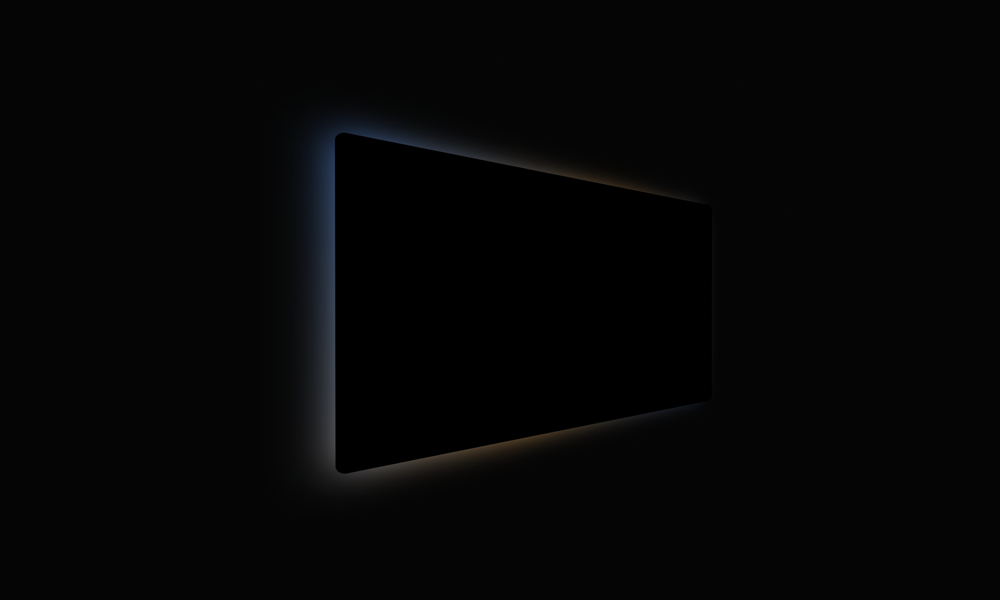

import tracking_video from '../assets/videos/tracking_video.mp4'
import face_screen from '../assets/images/projects/face_tracking/face_screen.png'
import face_3 from '../assets/images/projects/face_tracking/face_3.png'
import face_tracking from '../assets/images/projects/face_tracking/face_tracking.png'
import ProjectHeader from "../components/ProjectHeader"

<ProjectHeader project={props.pageContext.frontmatter} />

<Video src={tracking_video} autoPlay loop muted/>

