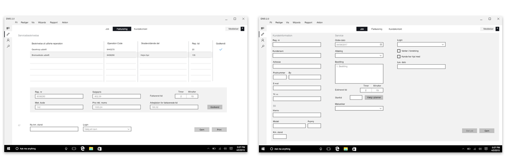
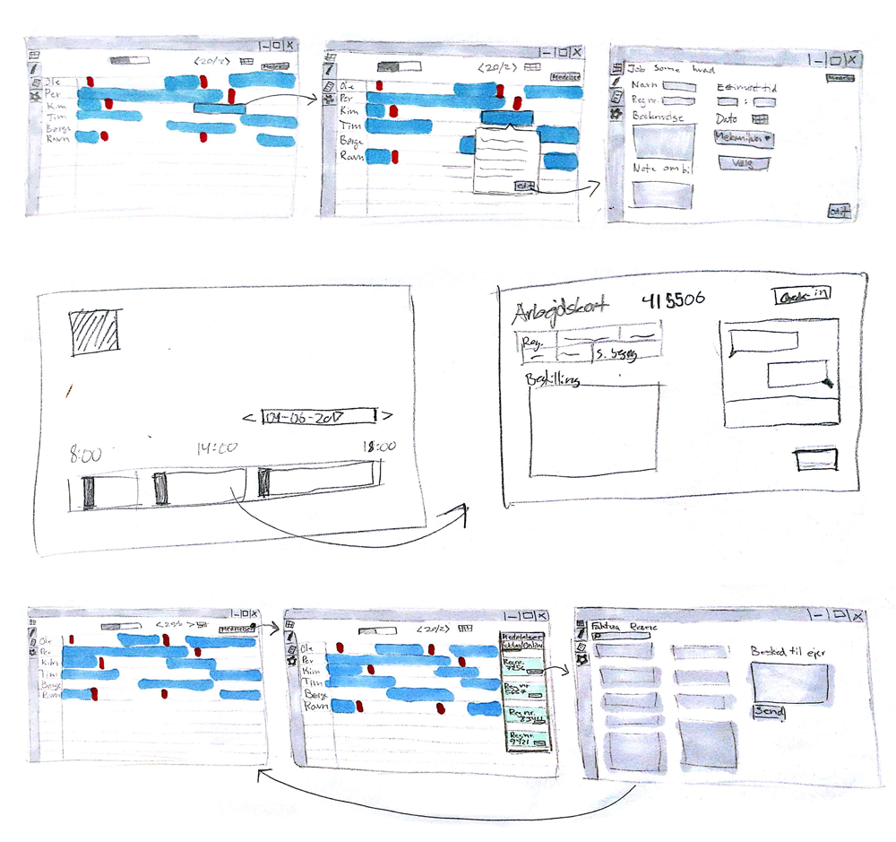
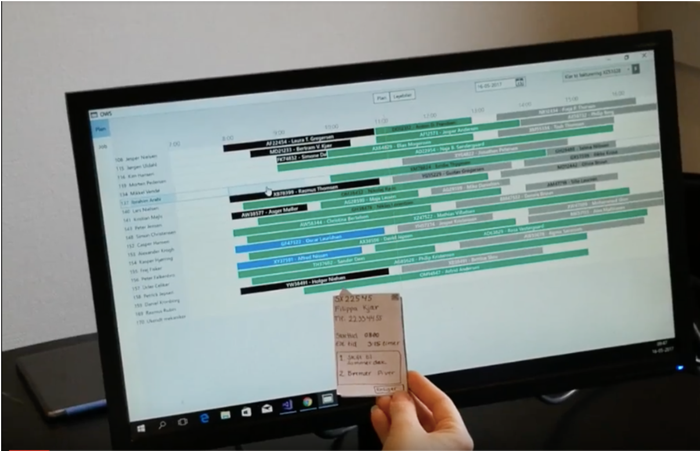

import ProjectHeader from "../components/ProjectHeader"

<ProjectHeader project={props.pageContext.frontmatter} />

## Case
Car workshop at a dealership is transforming their current use of paper worksheets to a completely digital system. In collaboration with foremans at the dealership we designed and tested a system to be used by the foremans. Based on research at the workshop we developed a set of requirements, tested high-fidelity prototypes and developed a functional prototype.
This case was a part of a project with a focus on construction of a service system.

## Construction

The application was made based on a course in Object-oriented Programming with C#. A simple MySQL database was created to support basic CRUD opperations.

