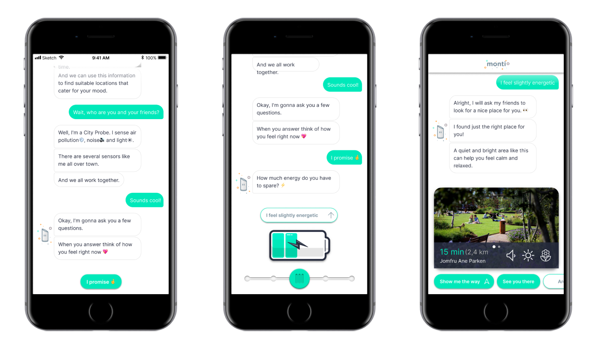

import ProjectHeader from "../components/ProjectHeader"

<ProjectHeader project={props.pageContext.frontmatter} />

### Case

Montem has been developing city probes and would like to offer IoT-based services in the future. In order to design meaningful interactions with the probes, Montem would like to follow a human-centric approach to prevent IoT systems from being purely technology driven. This case is part of a larger project aiming for transparency and sustainability, allowing citizens to interpret their everyday environment and react to changes in air quality - information and understanding is a key parameter in changing behaviours. The project should involve designing user interfaces and information visualisations for city probe stakeholders (citizens, administrators, researchers).

