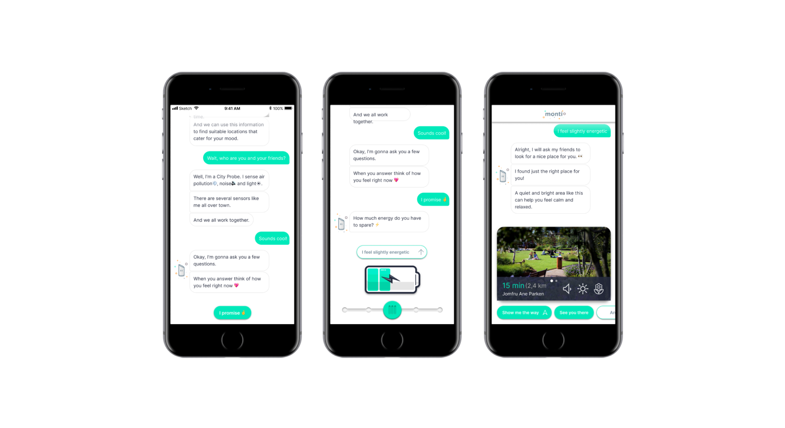

import ProjectHeader from "../components/ProjectHeader"

<ProjectHeader project={props.pageContext.frontmatter} />

### Case

Montem has been developing city probes and would like to offer IoT-based services in the future. In order to design meaningful interactions with the probes, Montem would like to follow a human-centric approach to prevent IoT systems from being purely technology driven. This case is part of a larger project aiming for transparency and sustainability, allowing citizens to interpret their everyday environment and react to changes in air quality - information and understanding is a key parameter in changing behaviours.

### App

RoPå allows users to talk to Monti, the collective mind of all Montem's probes. By giving information such as current mental state, users get suggestions from Monti about nice locations in the city, based on data from Montem's probes.

